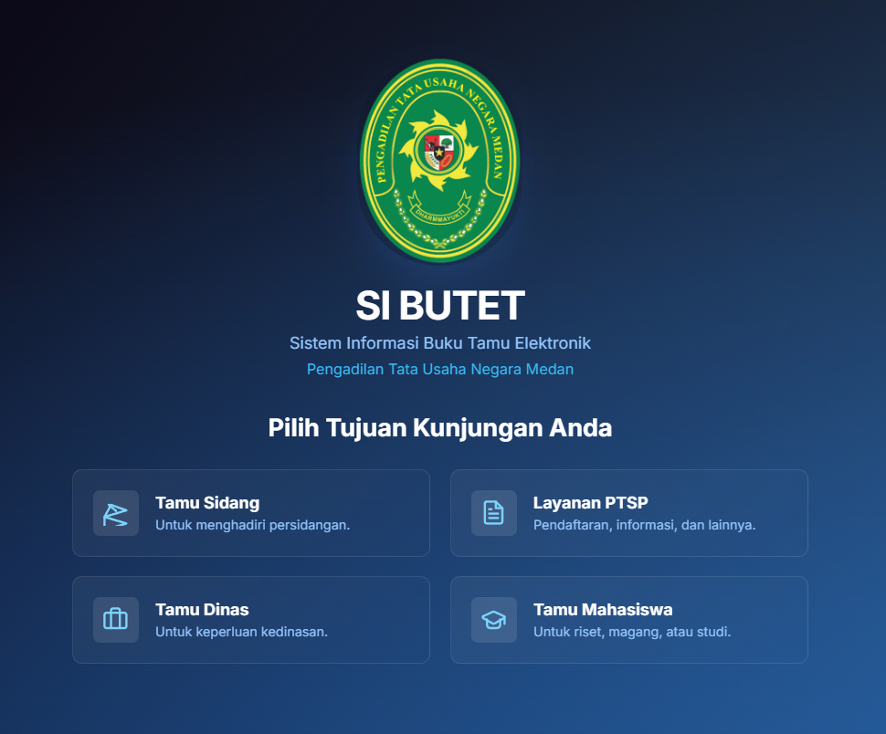
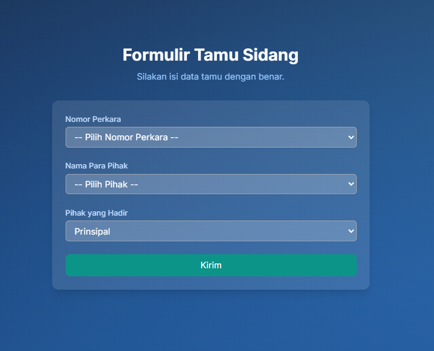
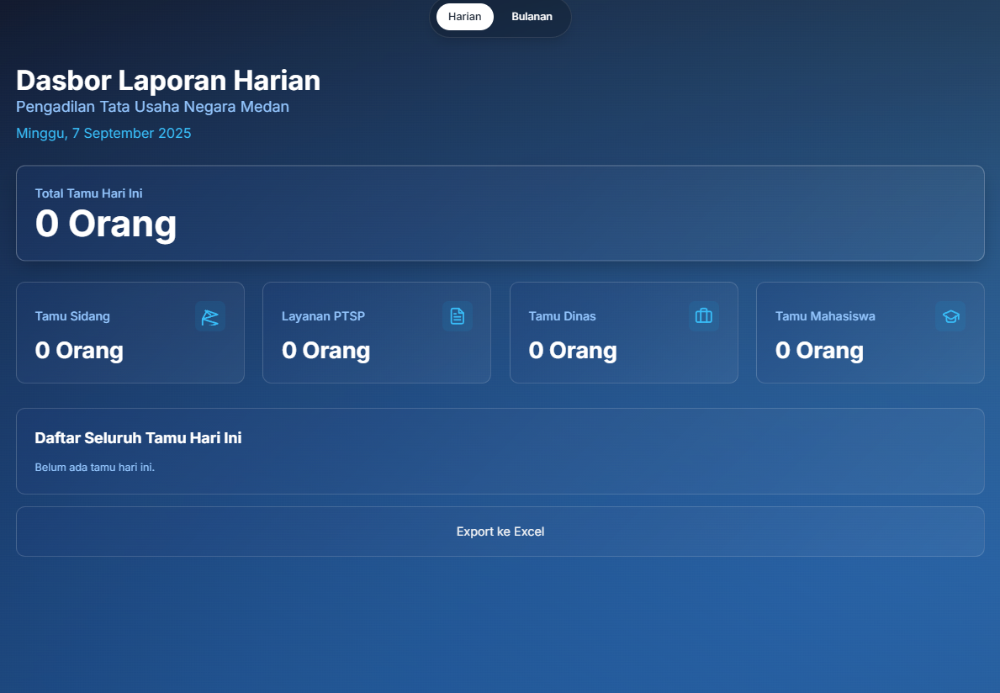
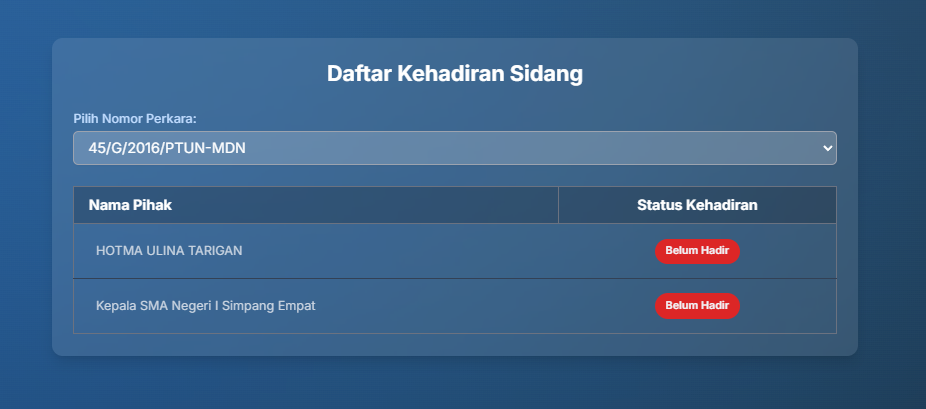

# Visitor Guestbook System

A Laravel-based visitor management system designed for the Medan State Administrative Court (Pengadilan Tata Usaha Negara Medan). This application streamlines guest registration, attendance tracking, and the generation of structured daily and monthly reports.

## Overview

This application categorizes visits into specific types to keep everything organized. Alongside the visitor input forms, it features a quick-glance dashboard, an attendance tracker based on case numbers, and a feature to export reports directly to Excel.

## Key Features

- **Quick Navigation Dashboard:** A centralized hub to easily access different visit categories.
- **Tailored Registration Forms:**
  - Court Hearing Guests (*Tamu Sidang*)
  - PTSP Services (*Layanan PTSP*)
  - Official/Agency Guests (*Tamu Dinas*)
  - Student Guests (*Tamu Mahasiswa*)
- **Attendance Tracking:** Check and monitor guest status by their specific case number.
- **Daily Reports:** View today's total guests and detailed visit logs.
- **Monthly Reports:** Get a comprehensive summary of visits over a specific period.
- **Excel Export:** Easily download your reports in `.xlsx` format.
- **Responsive UI:** A clean, modern interface that works seamlessly on both desktop and mobile devices.

## Tech Stack

- Laravel 10
- PHP 8.1+
- Blade Template
- Vite
- Maatwebsite Excel
- Laravel Sanctum

## Page Structure

- `/dashboard` - Main navigation hub.
- `/pihak` - Form for court hearing guests.
- `/ptsp` - Form for PTSP services.
- `/dinas` - Form for official guests.
- `/mahasiswa` - Form for student guests.
- `/kehadiran` - Attendance list grouped by case number.
- `/laporan` - Daily reports.
- `/bulanan` - Monthly reports.

## Prerequisites

Make sure your environment meets the following requirements:
- PHP 8.1 or higher
- Composer
- Node.js & npm
- MySQL or MariaDB

## Installation

1. Clone this repository to your local machine.
2. Install the backend and frontend dependencies:

```bash
composer install
npm install

3. Copy the environment file and generate the application key:

```bash
Copy-Item .env.example .env
php artisan key:generate
```

4. Open the `.env` file and configure your database settings.
5. Run the database migrations:

```bash
php artisan migrate
```

6. Start the development servers in two separate terminals:

```bash
php artisan serve
npm run dev
```

## How to Use

1. Open the main dashboard in your browser.
2. Select the guest category that matches the visit.
3. Fill out the visitor data form.
4. Check the quick summary on the dashboard.
5. Head over to the daily or monthly report menus to review logs or export the data to Excel.

## Screenshots

Here's a quick look at the application (images are stored in `public/docs/screenshots/`).

### Main Dashboard



### Visitor Form



### Daily Report



### Attendance Page



## Development Notes

- The application uses Laravel Blade for rendering views.
- Report exports are handled by the `maatwebsite/excel` library.
- The route structure is modularized based on visit types and report needs.

## License

This project is open-sourced software licensed under the MIT license.

## Author

## Author

<table width="100%" style="border: none;">
  <tr style="border: none;">
    <td align="left" width="50%" style="border: none;">
      <strong>Ergy David Lundy Tumanggor</strong>
    </td>
    <td align="right" width="50%" style="border: none;">
      <a href="https://www.linkedin.com/in/ergy-david-lundy/">
        
      </a>
      <a href="https://github.com/Ruminas99">
        
      </a>
    </td>
  </tr>
    <tr style="border: none;">
    <td align="left" width="50%" style="border: none;">
      <strong>Joenathan Daniel Sihombing</strong>
    </td>
    <td align="right" width="50%" style="border: none;">
      <a href="#">
        
      </a>
      <a href="#">
        
      </a>
    </td>
  </tr>
</table>
